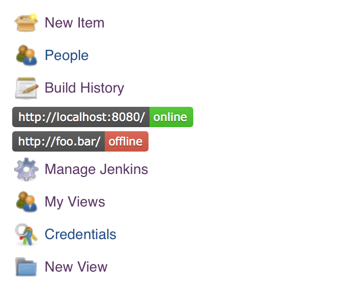

# server status Plug-in for Jenkins

Customization of the sidebar link plugin to add server status badges to the sidebar of the jenkins global view, letting you know if your servers are up or down. This is helpful when you have deployments or other jobs that will need to reach a specific server. Know ahead of time if they are going to fail due to an outage!

See also:

- [Jenkins Wiki - Sidebar Link Plug-in](https://wiki.jenkins-ci.org/display/JENKINS/Sidebar-Link+Plugin)
